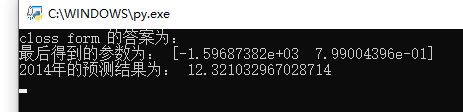
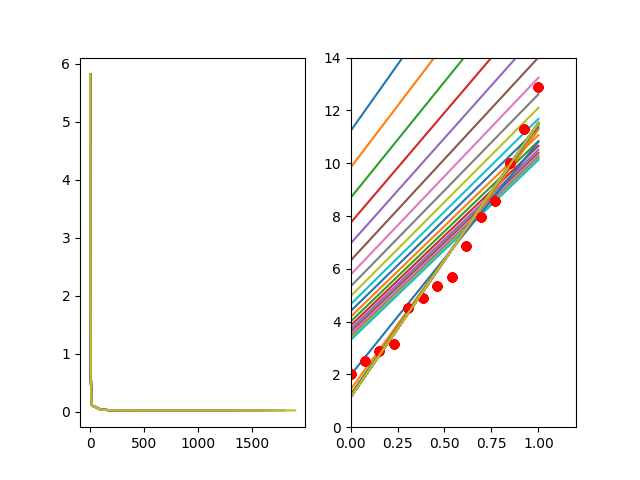

## 使用环境：

1. python3 解释器
2. 第三方软件包 numpy、matplotlib

## 实验结果：

- ### close-form：

  两个参数分别为 -1.59687382e+03 和 7.99004396e-01

  预测结果为 12.321032967028714

  如图：

  

  
图1 close-form控制台

- ### Gradient Descent：

  因为在做 Gradient Descent 的时候用了归一化，所以最后的得到的参数与实际结果不同。

  两个参数分别为 -0.07936042 和  0.95294102

  预测结果为 12.321032965676205

  <table>
      <tr>
          <td>
              

              
图2 GD控制台

          </td>
          <td>
              

              
图3 GD图示

          </td>
      </tr>
  </table>

  